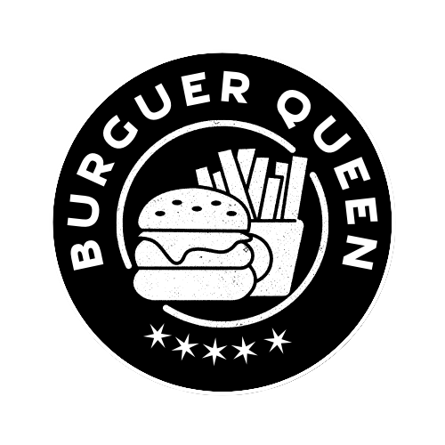
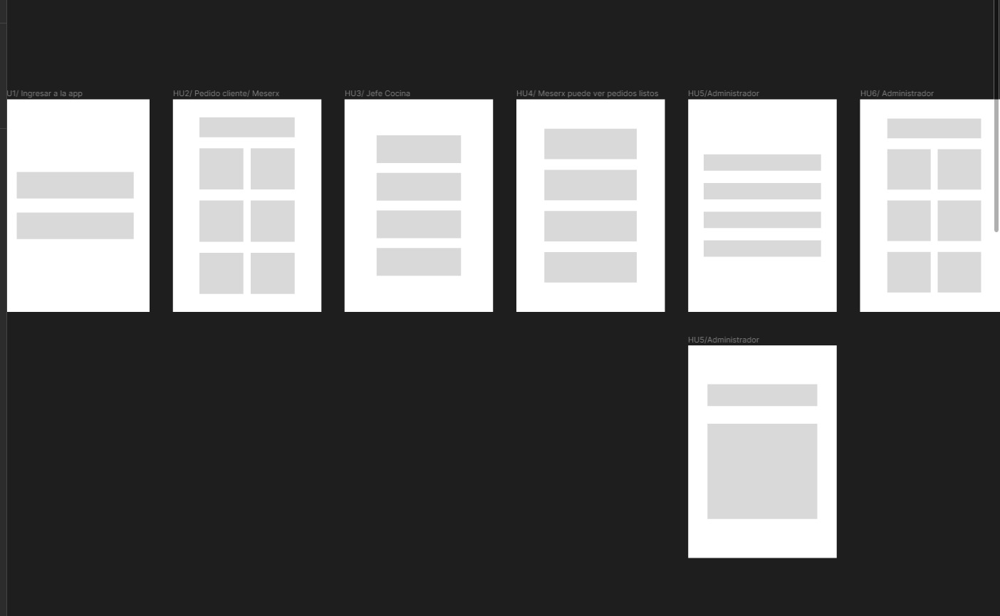
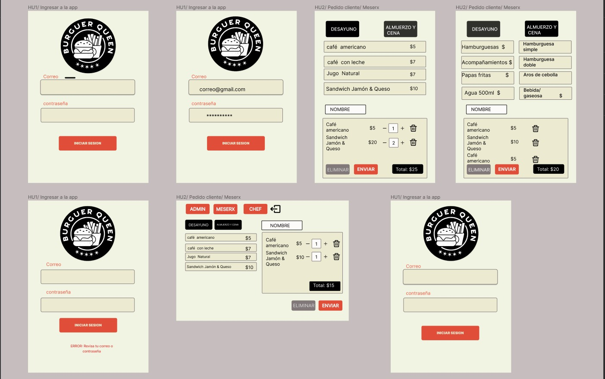

# Burger Queen (API Client)

## Índice

* [1. Resumen del proyecto](#1-resumen-del-proyecto)
* [2. Historias de usuario](#2-historias-de-usuario)
* [3. Prototipo de baja fidelidad](#3-prototipo-de-baja-fidelidad)
* [4. Prototipo de alta fidelidad](#4-prototipo-de-alta-fidelidad)
* [5. Modo de uso](#5-modo-de-uso)

***
## 1. Resumen del proyecto

Burguer Queen es una aplicación enfocada para ser usada en  Restaurantes, a través de la cual se pueden tomar pedidos usando una tablet y enviarlos a cocina para que se preparen de manera ordenada y eficiente.

### ¿Qué problema resuelve el producto?

##### Conectividad y comunicación:

* Podrán tener mejor comunicación entre el chef, el mesero y el administrador, sabiendo en el instante la necesidad o información que se quiere entregar.

##### Organización:

* Los pedidos hechos al mesero y sus modificaciones llegarán en el instante a cocina, las órdenes ya listas serán enviadas desde cocina en forma más rápida.

##### Seguridad:
* Cada usuario tiene que ser registrado y acceder con una contraseña.

## 2. Historias de Usuario

Esta aplicación actualmente está en proceso, por lo que las vistas que tenemos corresponden a las siguientes historias de usuario:
#### [Historia de usuario 1] Mesero/a debe poder ingresar al sistema, si el admin ya le ha asignado credenciales

Yo como meserx quiero poder ingresar al sistema de pedidos.

##### Criterios de aceptación

Lo que debe ocurrir para que se satisfagan las necesidades del usuario.

* Acceder a una pantalla de login.
* Ingresar email y contraseña.
* Recibir mensajes de error comprensibles, dependiendo de cuál es el error
  con la información ingresada.
* Ingresar al sistema de pedidos si las crendenciales son correctas.

#### [Historia de usuario 2] Mesero/a debe poder tomar pedido de cliente/a

Yo como meserx quiero tomar el pedido de unx clientx para no depender de mi mala
memoria, para saber cuánto cobrar, y enviarlo a la cocina para evitar errores y
que se puedan ir preparando en orden.

##### Criterios de aceptación

Lo que debe ocurrir para que se satisfagan las necesidades del usuario

* Anotar nombre de clientx.
* Agregar productos al pedido.
* Eliminar productos.
* Ver resumen y el total de la compra.
* Enviar pedido a cocina (guardar en alguna base de datos).
* Se ve y funciona bien en una _tablet_ tanto de manera vertical como horizontal.

## 3. Prototipo de baja fidelidad

 ## 4. Prototipo de alta fidelidad

 

 ## 5. Modo de uso

 * El login:
  - El usuario tiene credenciales entregadas por el administrador.

 * Orden(vista del mesero):
  -  El usuario puede filtrar la información entre desayuno y resto del día (almuerzo y cena), cada producto se agrega a la lista de órdenes al ser presionado.

  - En la parte de órdenes se dará un resumen y suma de los productos seleccionados, el cual será enviado a cocina con el nombre del cliente que solicita, la cual debe ser confirmada antes de enviarse.

  - Si se quiere sumar o restar un producto tienes dos opciones, presionando el mismo producto o con el botón + que aparece en la lista de órdenes.

  - Si se requiere eliminar la orden la aplicación pedirá confirmar esta acción.

  - Al enviarse la orden aparece un mensaje de que el pedido fue hecho de manera exitosa, de manera contraria se mostrará un mensaje de error cuando no se pueda realizar el pedido de la orden.

  ## Creditos:

[Kat Bravo]
[Mabel Cárdenas]